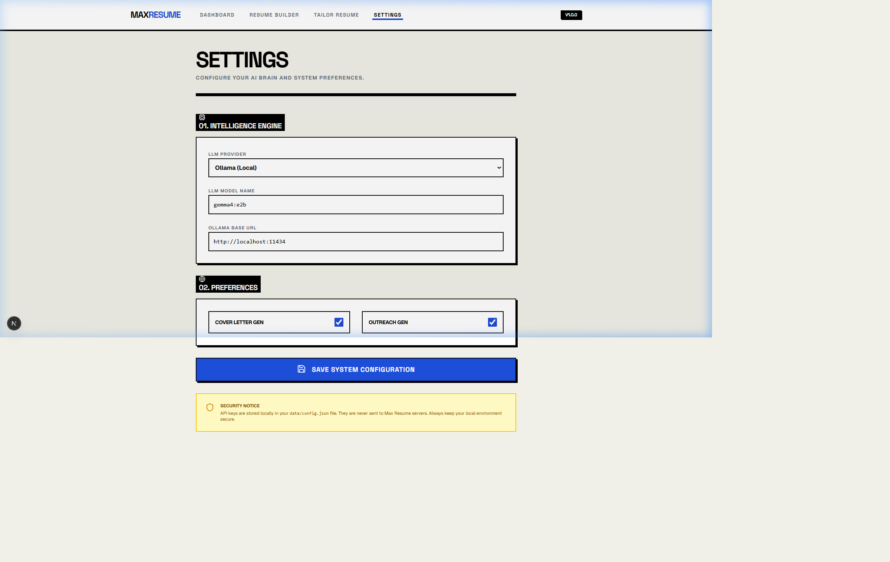

# 🚀 MaxResume: AI-Powered Resume Tailor


> **Match your identity to the role with Swiss precision.**

MaxResume is a production-grade AI platform designed to bridge the gap between your master resume and specific job descriptions. Using state-of-the-art LLMs (Gemini, GPT, or local Llama/Gemma via Ollama), it surgically tailors your experience to highlight exactly what recruiters are looking for.

---

## ✨ Features

- 🛠️ **Brutalist UI**: High-contrast, performance-first interface built for speed and clarity.
- 🤖 **AI Matching Engine**: Multi-pass analysis to align skills, experience, and projects.
- 🔒 **Privacy First**: Support for **Local LLMs** via Ollama—your resume never leaves your machine.
- 📄 **One-Click Export**: High-quality, print-ready PDF export with flexible layout options.
- 🆔 **Identity Persistence**: Unique ID tracking for all resume sections to ensure stable editing.

---

## 📸 Preview

> Upload your resume → Paste JD → Get tailored resume in seconds

---

## 🛠️ Tech Stack

- **Frontend**: Next.js 15+, Tailwind CSS, Lucide Icons, dnd-kit.
- **Backend**: FastAPI (Python 3.10+), SQLAlchemy, SQLite.
- **AI Integration**: LiteLLM (Gateway to Gemini, OpenAI, Ollama).

---

## ⚡ Quick Start

### 1. Backend Setup
```bash
cd backend
python -m venv v
.\v\Scripts\activate
pip install -r requirements.txt
uvicorn app.main:app --reload --port 8000
```

### 2. Frontend Setup
```bash
cd frontend
npm install
npm run dev
```

### 3. First Run
The `data/` folder will be created automatically on first backend start.
Open `http://localhost:3000` and go to Settings to configure your AI provider.

---

## ⚙️ Configuration Guide

1. Rename `data/config.example.json` to `data/config.json`.
2. Configure your preferred model:
   - **Gemini**: Set `LLM_MODEL` to `gemini/gemini-2.5-flash`.
   - **OpenAI**: Set `LLM_MODEL` to `openai/gpt-4o`.
   - **Ollama**: Set `LLM_MODEL` to `ollama/llama3`.

---

## 🤝 Contributing

Contributions are welcome! Please feel free to submit a Pull Request.

## 📄 License

This project is licensed under the **MIT License** - see the [LICENSE](LICENSE) file for details.

Developed with ❤️ by **Vatsal Paneri**.
